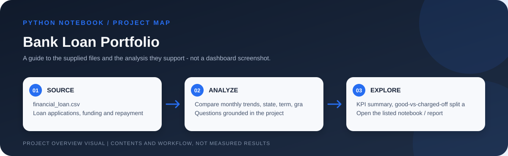

# Bank Loan Portfolio Analysis



> Workflow illustration only; it is not a dashboard screenshot or a source of measured results.


> **Question:** How large is this loan portfolio, how much has been funded and repaid, and how do outcomes vary by time, borrower, and loan characteristics?

This Jupyter analysis turns 38,576 loan records into a portfolio overview. It pairs data inspection with core lending KPIs, a good-loan / charged-off comparison, and visual breakdowns that help a reader explore where lending volume and risk are concentrated.

## At a glance

| Applications | Funded amount* | Good-loan share | Charged-off share |
| ---: | ---: | ---: | ---: |
| **38,576** | **435.76M** | **86.18%** | **13.82%** |

The notebook defines *good loans* as `Fully Paid` or `Current`, and *bad loans* as `Charged Off`. In the available notebook output, those groups contain 33,243 and 5,333 applications respectively. These are descriptive portfolio classifications, not a credit-risk model.

\* The notebook prints monetary values with a rupee symbol. The repository does not document the source currency, so verify the currency and units before reusing the monetary totals.

## What the notebook does

```mermaid
flowchart LR
    A[financial_loan.csv<br/>38,576 records] --> B[Inspect fields<br/>types and summaries]
    B --> C[Calculate portfolio KPIs<br/>applications  |  funded  |  received]
    C --> D[Segment by loan status<br/>good vs charged off]
    D --> E[Explore time and borrower mix<br/>month  |  state  |  term  |  purpose]
    E --> F[Notebook charts and findings]
```

- Profiles the dataset and checks its columns and data types.
- Calculates total and month-to-date applications, funded amount, and received payments. The latest issue month in the notebook output is **December 2021**; this is the latest month in the supplied data, not the current calendar month.
- Calculates average interest rate and debt-to-income (DTI) ratio.
- Compares good and charged-off loans by application count, funded amount, and payments received.
- Visualizes monthly application/funding/repayment patterns and funding by state, term, employment length, purpose, and home ownership.

## Files in this project

| File | What it is for |
| --- | --- |
| [`Bank Loan Analysis.ipynb`](<./Bank Loan Analysis.ipynb>) | The analysis itself: Python imports, data review, KPI calculations, loan-status segmentation, and charts. Run cells in order to reproduce the notebook workflow. |
| [`financial_loan.csv`](<./financial_loan.csv>) | The tabular loan records read by the notebook. It has 38,576 rows and 24 fields, including issue date, status, term, grade, purpose, state, loan amount, total payment, interest rate, and DTI. |

## Open and run

1. Download or clone this project folder.
2. Open the notebook in JupyterLab, Jupyter Notebook, or VS Code.
3. Install the imports used by the notebook (`pandas`, `numpy`, `matplotlib`, `seaborn`, and `plotly`).
4. Update the CSV path near the top of the notebook. It currently points to a machine-specific Windows path.
5. Run the cells from top to bottom.

## Interpretation and reproducibility notes

- The notebook classifies historical outcomes; it does not estimate default probability, recommend approvals, or establish why a borrower repaid or charged off.
- `Current` and `Fully Paid` are grouped together as good loans, while only `Charged Off` is grouped as bad loans. Other statuses should not be silently folded into those categories.
- Currency is not established by the repository; the rupee formatting in the notebook may not represent the data's original currency.
- Update the source path after downloading. The notebook does not currently discover the adjacent CSV automatically.
- The source and reporting-period provenance are not fully described in this project folder.
