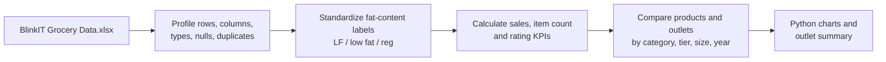

# BlinkIT Grocery Sales & Outlet Analysis

> **Question:** Which product and outlet characteristics are associated with sales in this grocery dataset?

This notebook analyzes **8,523 item/outlet records**. It starts with basic data-quality checks, normalizes inconsistent fat-content labels, and then compares sales and ratings across products, outlet tiers, outlet sizes, and outlet-establishment years. The result is a compact example of turning a retail extract into business-facing KPIs and charts.

## Snapshot from the notebook

| Total sales* | Average sales per record* | Records | Average rating |
| ---: | ---: | ---: | ---: |
| **1,201,681.49** | **140.99** | **8,523** | **3.97 / 5** |

The notebook reports **1,463 missing `Item Weight` values**. The missing weights are identified during profiling; the documented cleaning step standardizes labels rather than filling those weights.

\* The notebook does not establish a currency for `Sales`; interpret these amounts in the dataset's own units.

## Analysis flow

### Visual questions explored

- How does sales mix compare between **Low Fat** and **Regular** products?
- Which item types contribute the most sales?
- How do fat-content sales compare across outlet location tiers?
- How do recorded sales differ by outlet establishment year, outlet size, and outlet location type?
- What do sales, average sales, record counts, and ratings look like by outlet type?

The notebook builds a donut chart, bar chart, clustered comparison, year trend, outlet-size chart, location funnel, and outlet-type summary.

## Files in this project

| File | What it is for |
| --- | --- |
| [`Blinkit Analysis.ipynb`](<./Blinkit Analysis.ipynb>) | Loads the workbook, inspects data quality, harmonizes category values, calculates four KPIs, and builds the charts and grouped outlet summary. |
| [`BlinkIT Grocery Data.xlsx`](<./BlinkIT Grocery Data.xlsx>) | The supplied 8,523-row, 12-column dataset used by the notebook. Fields cover item identifiers/types/fat content, outlet identifiers/type/size/location/year, visibility, weight, sales, and rating. |

## Open and run

1. Download or clone this folder.
2. Open `Blinkit Analysis.ipynb` in Jupyter or VS Code.
3. Install the libraries imported by the notebook: `pandas`, `numpy`, `matplotlib`, and `seaborn` (plus `plotly` where used).
4. Update the workbook path near the top of the notebook to the downloaded file.
5. Run cells in order; chart output is produced by the notebook.

## Interpretation notes

- The unit/currency for `Sales` is not documented here. The displayed total should not be described as dollars, rupees, or another currency without verifying the data source.
- `Item Weight` is missing for 1,463 records. Any analysis requiring weight should account for those nulls.
- Sales are compared across records and outlet/product categories; the charts are descriptive and do not demonstrate that an outlet feature caused a sales difference.
- Source provenance and a refresh date are not documented in the project files.
